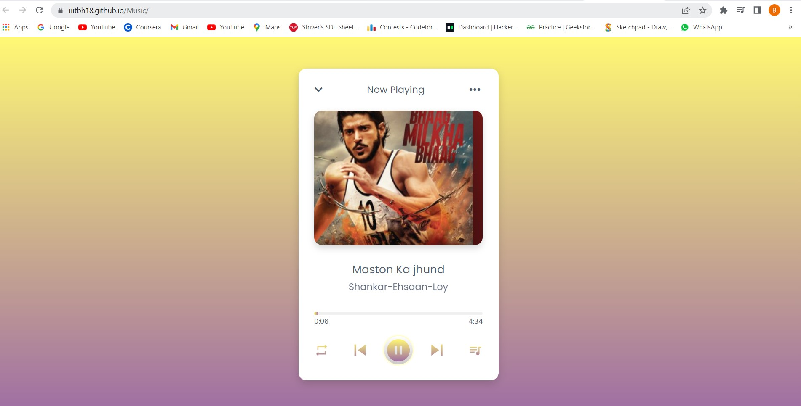
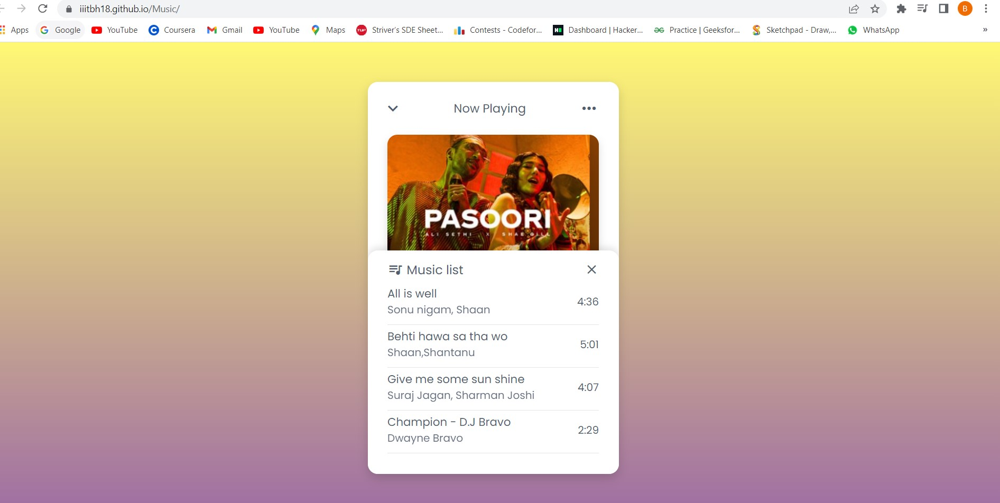

# MusicApp

>  A Music Player developed using JavaScript, CSS, and HTML. Users can click the Forward play, Backward play, Playlist loop and Shuffle music buttons to change the songs.

## Live Demo
[Live Demo Link](https://iiitbh18.github.io/Music/) :point_left:

Landing Page:

    

Music List:

    

